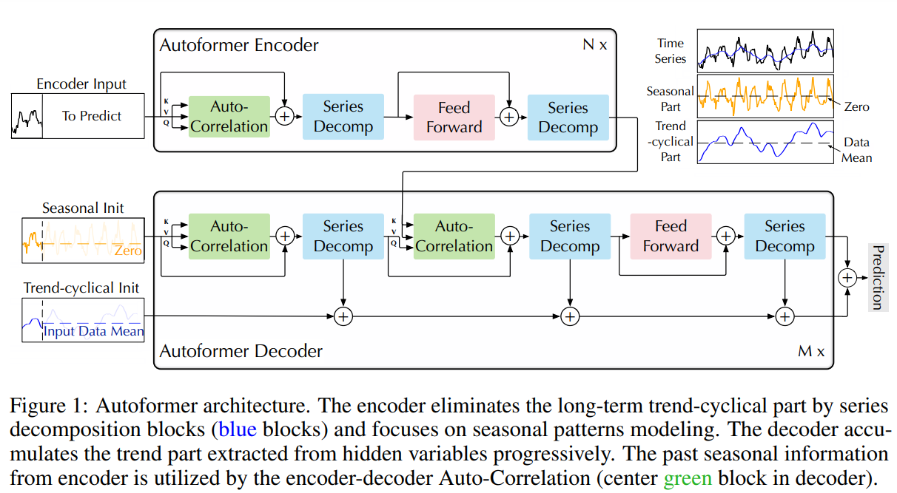
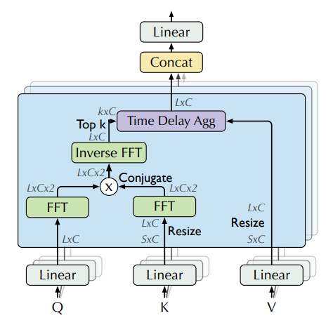

# ThinkBeforeYouTest
Comparative Statistical and Structural Analysis of Time Series Forecasts Using Transformers, LSTMs, and AR Models

# Testing Timeseries Data - Principles
In order to test for timeseries data, for example, Hypothesis Testing, T testing/Z testing, the following assumptions from Econometrics need to be met: 
- Linearity in Parameters: The relationships between variables can be expressed with additive terms and coefficients.
- Stationarity: We assume that the statistical properties do not change over time. If the data is not stationary, transformations like differencing or detrending are often needed before analysis. 
- No Autocorrelation: Errors terms need to be uncorrelated with each other. So the error in one time should not be related to an error in another time.
- Exogeneity: Explanatory variables are not influenced by the error term.
- No Multicollinearity
- Correct Specification of the regression model.


# Autoformer
Autoformer builds upon the econometrics method of decomposing time-series into seasonality and trend-cycle components. This is achieved through *Decomposition Layer* which enhances the model's ability to capture these components accurately. Autoformer also introduces an innovative auto-correlation mechanism that replaces the standard self-attention used in the vanilla transformer. *This enables the model to uitilize period-based dependencies in the attention.*

<p align="center">
  
</p>

## Decomposition of Time series
Decomposition is a method of breaking down a time-series into three systematic components: trend-cycle, seasonal variation, and random fluctuations. Trend-cycle represents trend of the data over a long period of time (stable). While, the seasonal component represents recurring patterns within an interval and random flucations represent random noise. <br>

By decomposition (additive or multiplicative) we can better understand the underlying patterns. 

For an input series
```math 
X \in R^{Lxd}
```
where L = length and the decomposition layer returns trend, and seasonal defined as:
```math
X_{trend} = AvgPool(Padding(X))
```
```math
X_{seasonal} = X - X_{trend}
```
The first equation is the moving average over the time-series, which smooths out short-term fluctuations. Padding is used to maintain the same length as the input. <br>
The second equation subtracts the trend, and we are left with seasonal and high-freqeuncy components.
<br>

# Attention (Autocorrelation)
In the vanilla Time Series Transformer, attention weights are computed in the time domain and point-wise aggregates (every timestep attends to other timestep). But Autoformer, computes the scores in frequency domain using fast fourier transformation and aggregates them by time delay (time-shited) representations. <br>

**Why does this work?**: 
- Seasonality, cycles, and trends show up as frequency components.
- Instead of learning every periodic pattern from scratch, Autoformer naturally represnts them in frequency space (just like embeddings for natural language and images).
- Fourier transforms global and local patterns both.

## Fast Fourier Transformation (FFT)
It is a fast algorithm to compute the Discrete Fourier Transform (DFT):
```math
X_{k} = \sum_{n=0}^{N-1} x_n . e^{-i2\pi kn/N}, k = 0, ..., N-1
```
where x_n is time series of length N and X_k is the amplitude frequency k. <br>
Time series are just combinations of sine and cosine waves. The FFT breaks down your signal into these frequency components:
- Low frequency -> slow trends
- High frequency -> short-term fluctuations

# Frequency Domain Attention
<p align="center">
  
</p>

```math
Autocorrelation(\tau) = Corr(y_t, y_{t-\tau})
```

Autoformer extracts frequency dependencies from the queries and keys. 

## Time-delay Aggregation
In standard self-attention, Value Matrices are aggregated using a dot-product. However in the Autoformer, we algin V by calculating its value for each *time delay* which is known as **Rolling**. Then we conduct element-wise multiplication between aligned V and the autocorrelations (attn_weights). <br>

```math
\tau _1, \tau _2, ..., \tau _n = \text{arg} \text{Top-k}(R_{q, k}(\tau))
```

```math
\hat{R_{q, k}(\tau _1)}, \hat{R_{q, k}(\tau _2)}, ...\hat{R_{q, k}(\tau _n)} = Softmax(R_{q, v}(\tau _1), R_{q, v}(\tau _2), ..., R_{q, v}(\tau _n))
```

```math
\text{Autocorrelation-Attention} = \sum^k_{i=1}\text{Roll}(V, \tau _i) . \hat{R}_{q, v}(\tau _i)
```

## MASE (Mean Absolute Scaled Error)

MASE (Mean Absolute Scaled Error) is a scale-independent metric used for evaluating forecast accuracy. It was introduced to overcome limitations of other metrics like MAE, RMSE, or MAPE, especially in intermittent or non-stationary time series.