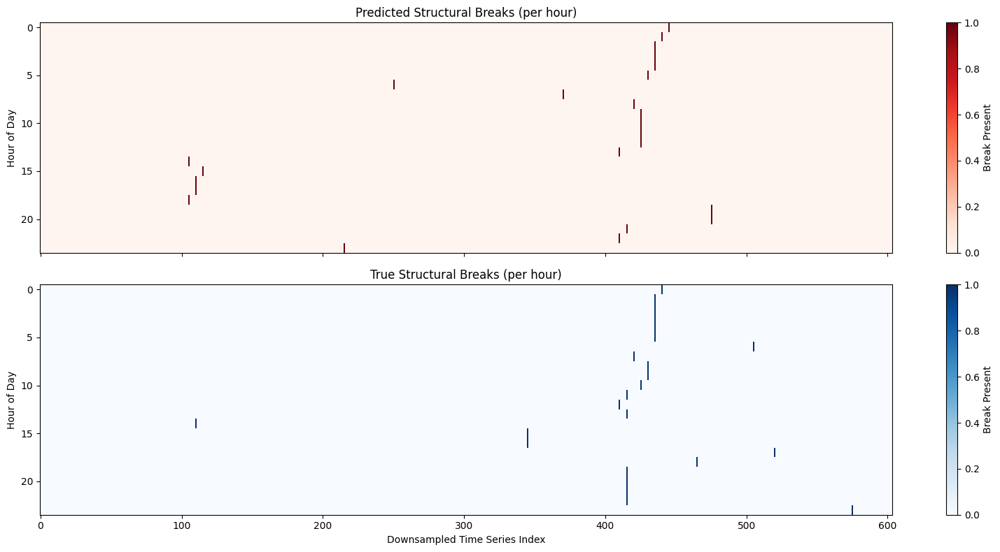
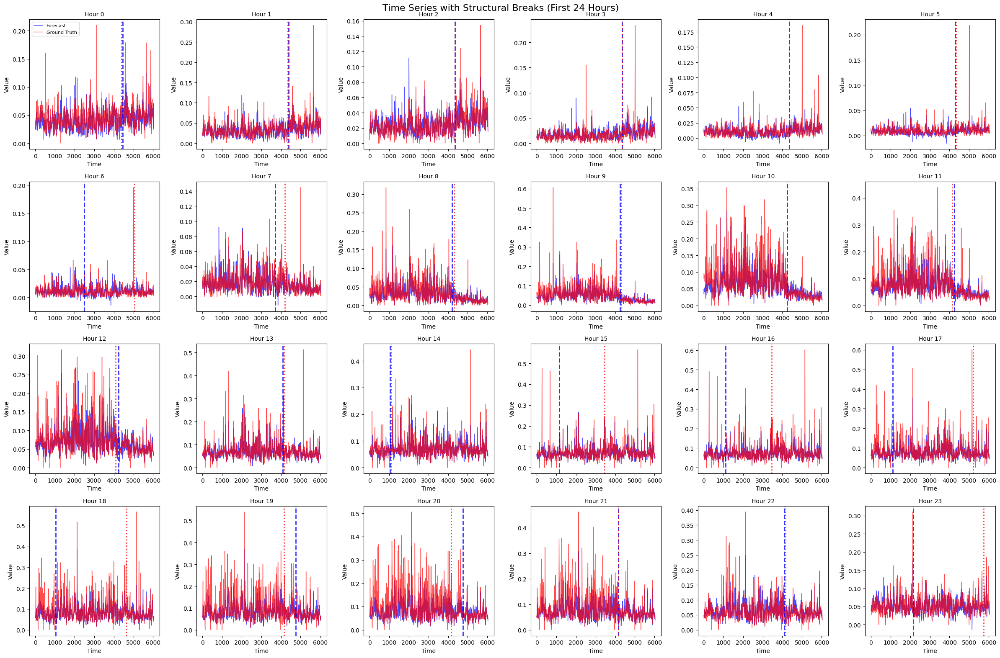
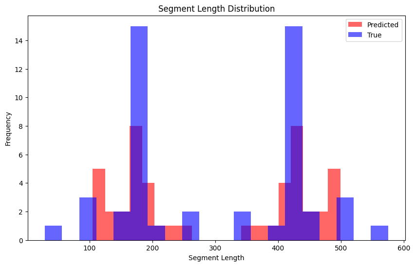
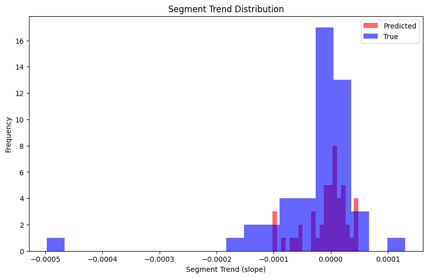
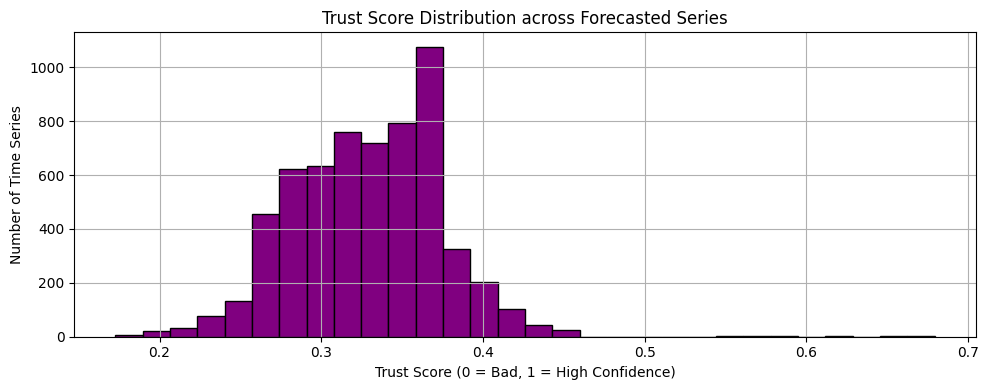

# ThinkBeforeYouTest
Comparative Statistical and Structural Analysis of Time Series Forecasts Using Transformers, LSTMs, and AR Models

# Testing Timeseries Data - Principles
In order to test for timeseries data, for example, Hypothesis Testing, T testing/Z testing, the following assumptions from Econometrics need to be met: 
- Linearity in Parameters: The relationships between variables can be expressed with additive terms and coefficients.
- Stationarity: We assume that the statistical properties do not change over time. If the data is not stationary, transformations like differencing or detrending are often needed before analysis. 
- No Autocorrelation: Errors terms need to be uncorrelated with each other. So the error in one time should not be related to an error in another time.
- Exogeneity: Explanatory variables are not influenced by the error term.
- No Multicollinearity
- Correct Specification of the regression model.


# Autoformer
Autoformer builds upon the econometrics method of decomposing time-series into seasonality and trend-cycle components. This is achieved through *Decomposition Layer* which enhances the model's ability to capture these components accurately. Autoformer also introduces an innovative auto-correlation mechanism that replaces the standard self-attention used in the vanilla transformer. *This enables the model to uitilize period-based dependencies in the attention.*

<p align="center">
  
</p>

## Decomposition of Time series
Decomposition is a method of breaking down a time-series into three systematic components: trend-cycle, seasonal variation, and random fluctuations. Trend-cycle represents trend of the data over a long period of time (stable). While, the seasonal component represents recurring patterns within an interval and random flucations represent random noise. <br>

By decomposition (additive or multiplicative) we can better understand the underlying patterns. 

For an input series
```math 
X \in R^{Lxd}
```
where L = length and the decomposition layer returns trend, and seasonal defined as:
```math
X_{trend} = AvgPool(Padding(X))
```
```math
X_{seasonal} = X - X_{trend}
```
The first equation is the moving average over the time-series, which smooths out short-term fluctuations. Padding is used to maintain the same length as the input. <br>
The second equation subtracts the trend, and we are left with seasonal and high-freqeuncy components.
<br>

# Attention (Autocorrelation)
In the vanilla Time Series Transformer, attention weights are computed in the time domain and point-wise aggregates (every timestep attends to other timestep). But Autoformer, computes the scores in frequency domain using fast fourier transformation and aggregates them by time delay (time-shited) representations. <br>

**Why does this work?**: 
- Seasonality, cycles, and trends show up as frequency components.
- Instead of learning every periodic pattern from scratch, Autoformer naturally represnts them in frequency space (just like embeddings for natural language and images).
- Fourier transforms global and local patterns both.

## Fast Fourier Transformation (FFT)
It is a fast algorithm to compute the Discrete Fourier Transform (DFT):
```math
X_{k} = \sum_{n=0}^{N-1} x_n . e^{-i2\pi kn/N}, k = 0, ..., N-1
```
where x_n is time series of length N and X_k is the amplitude frequency k. <br>
Time series are just combinations of sine and cosine waves. The FFT breaks down your signal into these frequency components:
- Low frequency -> slow trends
- High frequency -> short-term fluctuations

# Frequency Domain Attention
<p align="center">
  
</p>

```math
Autocorrelation(\tau) = Corr(y_t, y_{t-\tau})
```

Autoformer extracts frequency dependencies from the queries and keys. 

## Time-delay Aggregation
In standard self-attention, Value Matrices are aggregated using a dot-product. However in the Autoformer, we algin V by calculating its value for each *time delay* which is known as **Rolling**. Then we conduct element-wise multiplication between aligned V and the autocorrelations (attn_weights). <br>

```math
\tau _1, \tau _2, ..., \tau _n = \text{arg} \text{Top-k}(R_{q, k}(\tau))
```

```math
\hat{R_{q, k}(\tau _1)}, \hat{R_{q, k}(\tau _2)}, ...\hat{R_{q, k}(\tau _n)} = Softmax(R_{q, v}(\tau _1), R_{q, v}(\tau _2), ..., R_{q, v}(\tau _n))
```

```math
\text{Autocorrelation-Attention} = \sum^k_{i=1}\text{Roll}(V, \tau _i) . \hat{R}_{q, v}(\tau _i)
```

## MASE (Mean Absolute Scaled Error)

MASE (Mean Absolute Scaled Error) is a scale-independent metric used for evaluating forecast accuracy. It was introduced to overcome limitations of other metrics like MAE, RMSE, or MAPE, especially in intermittent or non-stationary time series. <br>

We use this metric to evaluate the forecasts. However, in this repository we dig in deep and try to evaluate how accurately does the Autoformer capture the contexts by evaluating structural breaks in detail. <br>

## Structural Breaks
A structural break in time series refer to sudden or gradual changes in the statistical properties of a time series, such as its mean, variance or trend, indicating a shift in the underlying process generating the data. <br>

I conducted structural break analysis both on predicted and ground truth time series. I applied Binary Segmentation algorithm from the ruptures package, using the least-squares ('L2') cost function as the detection criteria. Each time series was first aggregated by computing the mean forecast across all the samples for a given prediction horizon. <br>

To improve computational efficiecy, the collection of time series was downsampled by a factor of 10, resulting in a reduced set of series for structural break detection. <br>

For each of the 24 forecasted time steps, the algorithm was independently applied across the set of time series to identify change points. The number of candidate breakpoints *K* was optimized via **Bayesian Information Criteria**, which balances model fit and complexity. The same procedure was applied to corresponding ground truth series. <br>

Breakpoint sequences were encoded in binary matrices, with each row representing a specific forecast horizon and each column a downsampled time index. <br>

For comparitive analysis, I did multiple visualisation which are explained in detail below.

## Comparitive Analysis: Visualisations
1. Time Series Heatmap 
Here, I visualised the structural breaks across the downsampled time-series indices. Note that this heatmap only shows the occurence of a structural break across the indices compared to the true structural breaks found in the ground truth. Although we can see that the segmentation or the indices at which the structural break is found are different, the total number of predicted structural breaks matches the total number of true structural breaks which is **24**. 
<br>

<p align="center">
  
</p>

### Key Observations
- There is some overlap in hour-of-day (y-axis) where breaks are concentrated, especially between 8-12 hours and 15-18 suggesting the model captures temporal zones of volatility or change reasonbly well. 
- Predicted breaks show a high densitiy around 450-590 where many small segments seem to be detected. While True breaks appear more sparse and isolated indicating that the true process had more stable regimes. 
- The misalignment may reflect either model's uncertainty, forecast smoothness, or sensitivty of the break detection method to noise or fluctuations in the forecast.
- The forecasting model is sensitive to local variations and may over-segment the series in volatile regimes leading to *false detection of regime changes*
- BIC-Based Tuning may over-penalize complex segmentations missing real but subtle changes.

<p align="center">
  
</p>

Here I examine the forecast hour-by-hour in more detail. Here too we see that breaks appear clustered at certain time intervals, suggesting periodic regime changes. <br>

Some hours (early morning or late night) may have fewer breaks while peak activity hours (midday) show more breaks. <br>

## Segment Analysis
Segment Analysis is another good approach to studying the structural breaks. I examine multiple things here such as, How long are segments between breaks? Trends of each segment.

<p align="center">
  
</p>


### Key Observations
- Both distributionsa are right skewed which means most segments are short and few segments are very long. 
- Predicted segments tend to be shorter than true segments which suggests that the model is over-segmenting and detecting breaks too frequently which means noise (integral part of the dataset) is being misinterpreted as breaks. 
- True segments show peak around 100-200 time steps which is a common stable period and few segments beyond 500 steps which is a long-term stability. 
- Model is struggling a little to generalize leading to unncessary regime switches in forecasts and reduced predictive power for longer trends. 

<p align="center">
  
</p>

This plot compares the distribution of segment trends (slopes between structural breaks). 

### Key Observations
- Both distributions are centered near zero which means most segments have negligible trends which means the time-series is mean-reverting or stable for long periods. 
- Predicted segments are wider spread which means model may overestimate trend magnitudes and it has more extreme values so it tries to detect spurious trends in noisy regions. 
- True segments are tighter around zero indicating stable regimes. 
- However, the distributions are symmetric so no systemic upward or downward drift in the data and model preserves this balance. 
- As shown by the previous plots as well, model may overreact to noise and lead to false regime classifications and underestimate stability. 

## Trust-Score
Trust Score is a composite diagnostic metric designed to evaluate the statistical reliability and interpretability of a model's forecasted outputs. It assesses how well the predicted series adheres to key statistical properties that are desirable for downstream analysis such as Normality, Homoscedasticity and Lack of autocorrelation. 

<p align="center">
  
</p>

### Key Observations
- The majority of forecasted series have trust scores between 0.3 and 0.4 with a peak at approximately 0.37. 
- This suggests that most time-series fail at least 1 or 2 of the 3 statistical tests, indicating limited statistical reliability for post-forecast analysis. 
- None of the forecasted series fully satisfy all statiscal assumptions.
- The long tail towards higher trust scores shows that a small number of series are relatively well-behaved.
- This means that the model may require more refinement such as variance modeling or residual correction. 

